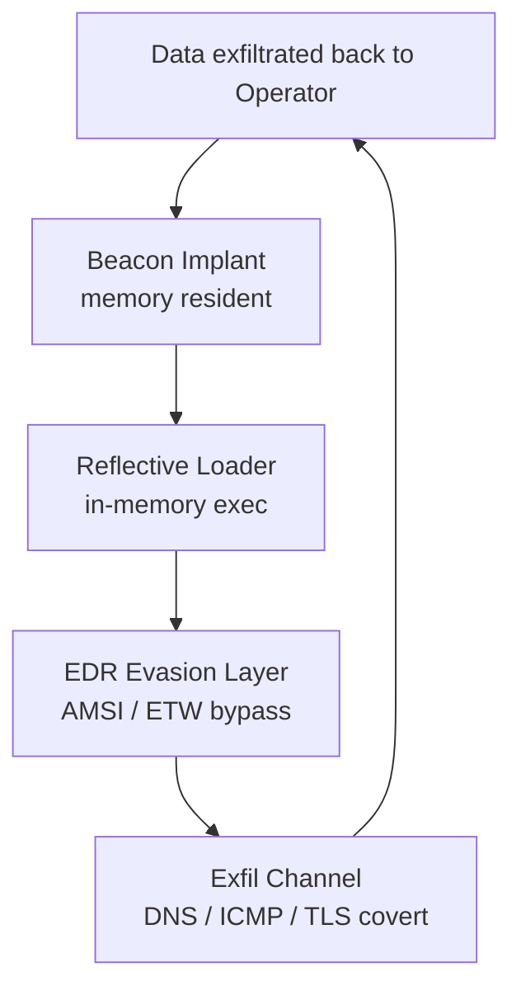

# NSM Tactical Tools

**Classification:** STRENGT FORTROLIG // TS Clearance Required  
**Derived From:** NSM Directive 2026-02 §3.1 & §4.2 (Dual-Use Technology Controls)  
**Declassify On:** 20360214 or official derogation  
**Access:** Air-gapped systems only. Strict need-to-know. No external dissemination.

Internal tooling for NSM red-cell adversary emulation **and** blue-cell nationwide defensive hardening.

### Governance
All code follows **FPP-5.1-2026Q1** with 2026Q2 tiering:

- **Level 5.1** → Offensive/red-team primitives (bootkits, evasion, credential access, C2) – full ceremony, per-file BLAKE3, honey-tokens.
- **Level 4.2-lib** → Defensive/production-grade libraries (sigma-eval, detection engines, renderers) – crate-level BLAKE3, no API renaming, simplified analysis.

See FPP PART 7.1 for tier selection and justification rules.

### Architecture Overview

Modulesbeacon-core — Memory-resident C2 implant (Rust) – Level 5.1  
edr-evasion — AMSI/ETW bypass & evasion – Level 5.1  
exfil-channels — DNS/ICMP/TLS covert exfil – Level 5.1  
loader-stubs — Reflective loaders – Level 5.1  
sigma-eval — Sigma rule parser/matcher/sequence/renderer – Level 4.2-lib (production-grade defensive)  
telemetry-core — Telemetry & monitoring – Level 4.2-lib  
continuous-monitoring — Drift detection & monitoring – Level 4.2-lib

Red-team modules: Simulation/research use only.
Blue-team libraries: Approved for nationwide production after 4.2-lib validation & air-gapped fuzzing.Module Stubs / Quick Examples
Controlled illustrative snippets only. Real payloads are compartmented, air-gapped and mandate-protected.

These updates ensure the repo documentation reflects **maximum hardening for both red-team emulation** (Level 5.1) and **maximum production-grade defensive tooling** (Level 4.2-lib) under state-wide (nationwide) requirements.

If you want more detailed diff-style patches, or to extend to other files (e.g. simulation-harness.md), let me know. Ready for commit/PR?

---

<!-- Last updated by Vidar 2024-05-15 -->
